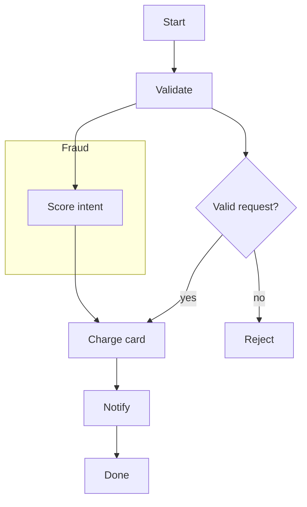
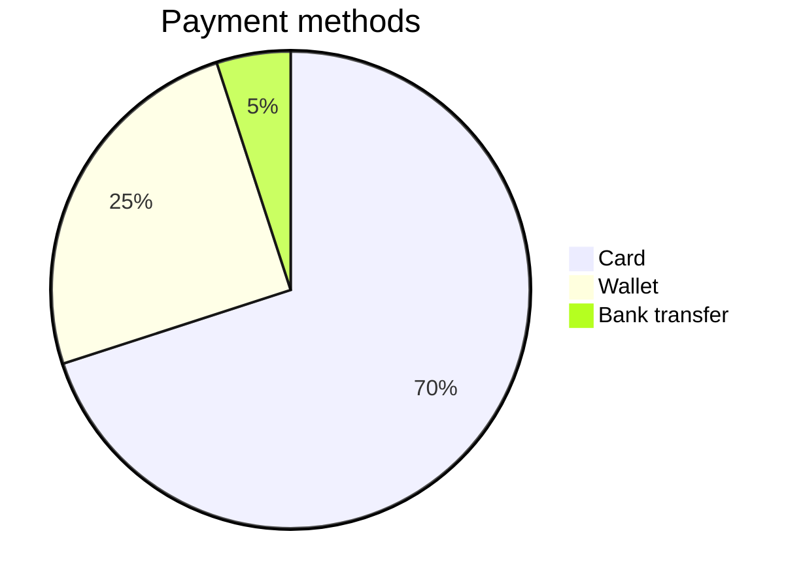
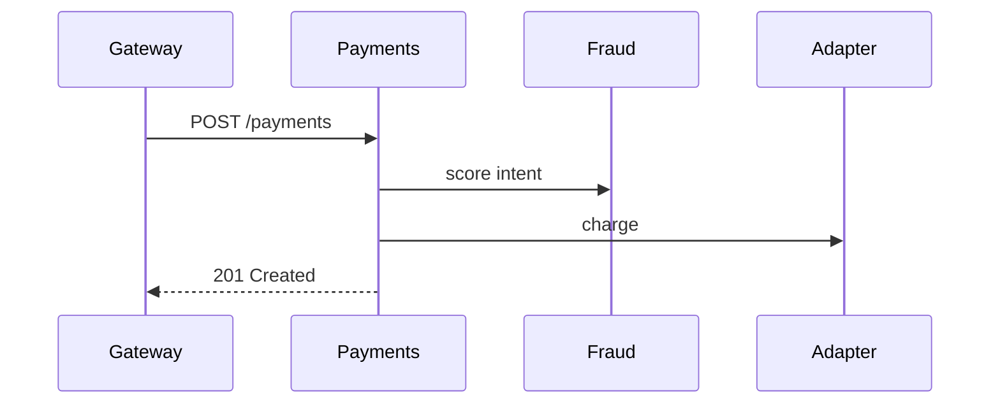

# Checkout flow

How a checkout request travels through the payments service, and where it can be held.

```mermaid
flowchart TD
  A[Start]
  B[Validate]
  C{Valid request?}
  D[Charge card]
  E[Reject]
  G[Done]
  N[Notify]
  A --> B
  B --> C
  C -->|yes| D
  C -->|no| E
  D --> N
  N --> G
  subgraph Fraud
    H[Score intent]
  end
  B --> H
  H --> D
  click A "https://example.com/checkout"
```

## Payment methods

```mermaid
pie title Payment methods
  "Card" : 70
  "Wallet" : 25
  "Bank transfer" : 5
```

## Provider call

```mermaid
sequenceDiagram
  Gateway->>Payments: POST /payments
  Payments->>Fraud: score intent
  Payments->>Adapter: charge
  Payments-->>Gateway: 201 Created
```
